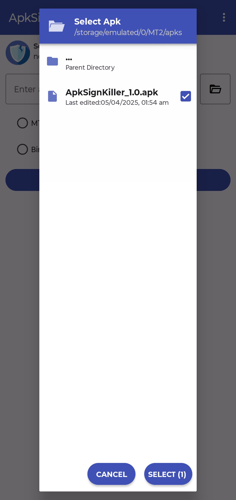
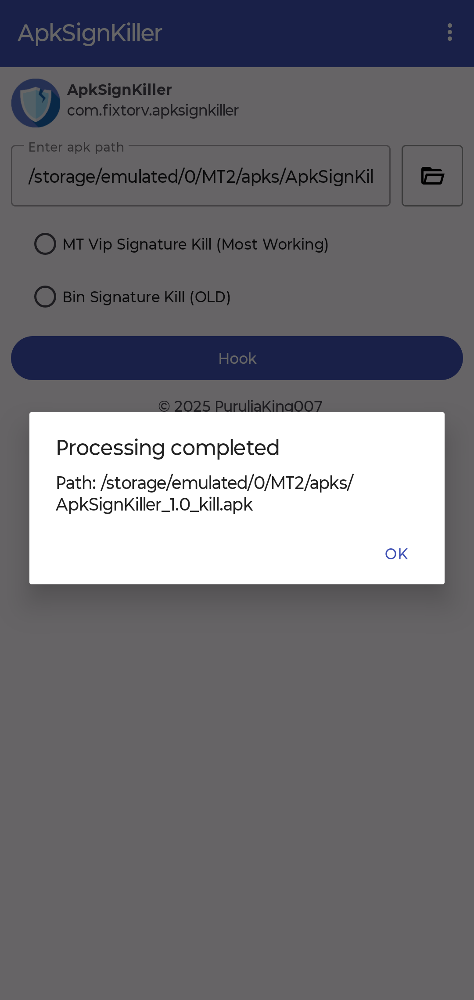

# ApkSignKiller

**ApkSignKiller** is an Android tool designed to remove or bypass signature verification checks in APK files.

## How It Works

ApkSignKiller utilizes the patching logic from the following open-source repositories:

- [ApkSignatureKillerEx](https://github.com/L-JINBIN/ApkSignatureKillerEx)
- [ApkSignatureKiller](https://github.com/L-JINBIN/ApkSignatureKiller)

## Screenshots
| Main screen                                                                 | Apk Selection                                                                    | Result                                               |
| ---------------------------------------------------------------------------- | --------------------------------------------------------------------------- | ---------------------------------------------------------------------------- |
|  |  |  |

## Used projects

* [ApkSignatureKiller](https://github.com/L-JINBIN/ApkSignatureKiller) by L-JINBIN
* [ApkSignatureKill](https://github.com/timscriptov/ApkSignatureKill) by timscriptov
* [android-filepicker](https://github.com/singhangadin/android-filepicker) by Angad Singh for file picker on older Android versions

## License

This project is licensed under the [Apache License 2.0](LICENSE).

You are free to use, modify, and distribute this software under the terms of the Apache License.  
See the full license for details.

---